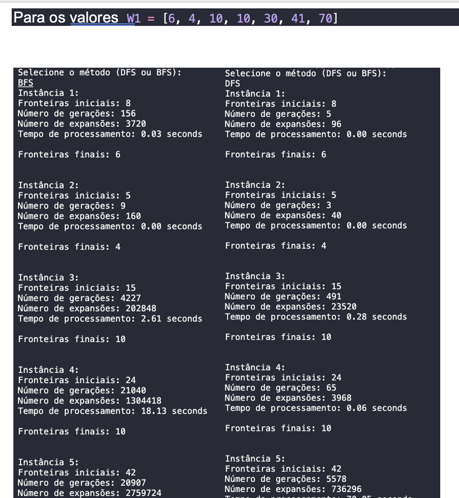

<h1 align="center">
    
</h1>

EfolioA de IIA
    
Os terrenos são quadrados e têm igual valor. Podem ser trocados terrenos que sejam vizinhos. Os proprietários pretendem fazer permutas de terrenos para reduzir o número de fronteiras. Não aceitam qualquer permuta que aumente o número de fronteiras. Existindo uma permuta que tenha uma maior redução do número de fronteiras, não aceitam uma outra com um menor redução:

📌 Programa sobre # EfolioA de IIA
problema de permutação de terrenos
------------------

## Sintaxe para executar:
<pre>python3 efolioA.py</pre>

O projeto foi feito em Python

The project was done with Python

🔧 Tecnologias utilizadas:
------------------

- Python
- MacOS

💬 Fale comigo
------------------
[*Entre em contato comigo*](https://www.linkedin.com/in/ivo-baptista-3712144/)

